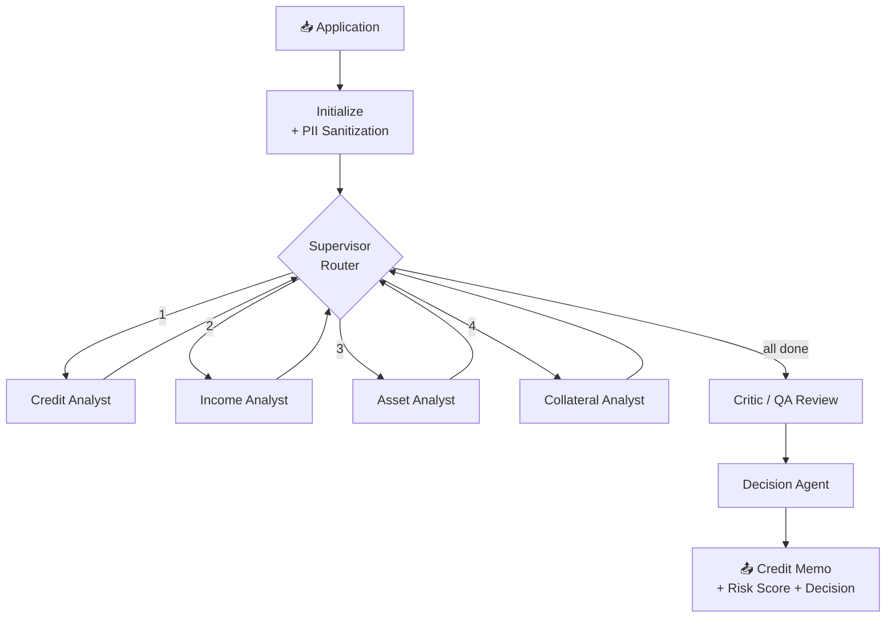

# 🏦 Mortgage Underwriting System

> A multi-agent AI pipeline that automates residential mortgage loan analysis using **LangGraph** and **OpenAI** — producing structured, auditable, compliance-aware underwriting decisions.


---

## 📋 Overview

This project simulates how a modern lender could use a team of **specialized AI agents** to review a mortgage application end to end. Instead of a single model making an opaque "yes/no" call, each financial dimension of the loan — credit, income, assets, and collateral — is analyzed by a dedicated agent that uses real calculation tools and retrieved underwriting policies.

A **Critic** agent then reviews every analysis for consistency, and a final **Decision** agent synthesizes everything into an audit-ready credit memo with:

- ✅ A clear decision: **APPROVED** / **DENIED** / **CONDITIONAL_APPROVAL**
- 📊 A **0–100 risk score**
- 📝 A full **credit memo** documenting the reasoning
- 🔍 A complete **reasoning chain** for auditability
- ⚖️ **Fair-lending bias flags** and a human-review trigger

> ⚠️ **Disclaimer:** This is an **educational / portfolio demonstration**, not a production lending system. It uses **fictional sample data** and must not be used to make real credit decisions. Real mortgage underwriting is subject to regulations such as ECOA, the Fair Housing Act, and TRID.

---

## 🗺️ Architecture

Each application flows through a **supervisor-routed** graph. The supervisor dispatches the four specialist analysts one at a time, then hands off to the Critic and Decision agents.



**Why a supervisor pattern?** It keeps each agent focused on one job, makes the flow easy to audit step-by-step, and lets you add or reorder analysts without rewriting the others.

---

## ✨ Features

| Capability | Description |
|------------|-------------|
| **6 specialized agents** | Credit, Income, Asset, Collateral, Critic, Decision |
| **Deterministic calculation tools** | DTI ratio, LTV ratio, housing-expense ratio, reserve coverage, large-deposit detection — agents use exact tool outputs instead of doing math themselves |
| **PII sanitization** | SSN, name, address, and phone are redacted *before* any data reaches the LLM |
| **Fair-lending compliance** | Automated bias-signal detection across every analysis |
| **Policy RAG** | Retrieval from built-in policy text, or bring your own policy PDF |
| **Audit trail** | LangGraph checkpointing persists per-case state and a full reasoning chain |
| **Human-in-the-loop** | Automatically flags cases for human review on high risk, bias, or non-approval |

---

## 🛠️ Tech Stack

- **Python 3.10+**
- **[LangGraph](https://langchain-ai.github.io/langgraph/)** — stateful multi-agent orchestration
- **[LangChain](https://www.langchain.com/)** + **langchain-openai** — LLM tooling
- **OpenAI** (default `gpt-4o-mini`, configurable)
- **ChromaDB** + **pypdf** *(optional)* — vector retrieval for custom policy PDFs

---

## 🚀 Getting Started

### Prerequisites

- Python 3.10 or newer
- An OpenAI API key

### 1. Clone & install

```bash
git clone https://github.com/Raliza2016/mortgage-underwriting-system.git
cd mortgage-underwriting-system
pip install -r requirements.txt
```

### 2. Configure your API key

```bash
cp .env.example .env
# Open .env and set your OPENAI_API_KEY
```

### 3. Run it

```bash
# Run all three built-in test cases
python main.py

# Run a single case by ID
python main.py --case TC-001

# Run from your own JSON file
python main.py --input path/to/my_case.json
```

---

## 🖥️ Sample Output

```text
======================================================================
  Case: TC-001  (Expected: APPROVED)
======================================================================
Running multi-agent pipeline...

  ✓ Credit completed
  ✓ Income completed
  ✓ Asset completed
  ✓ Collateral completed
  ✓ Critic completed
  ✓ Decision completed

✅ Final Decision : APPROVED
   Risk Score    : 22/100
   Human Review  : Not required
   Bias Flags    : 0

Reasoning Chain:
  1. Application TC-001 initialized
  2. Credit Analyst: Completed credit analysis for TC-001
  3. Income Analyst: Completed income analysis with DTI calculation
  4. Asset Analyst: Completed asset analysis and deposit review
  5. Collateral Analyst: Completed property analysis (LTV from tool)
  6. Critic: Completed review of all specialist analyses
  7. Decision Agent: Final decision APPROVED with risk score 22
```

---

## 📁 Project Structure

```text
mortgage-underwriting-system/
├── main.py                  # CLI entry point
├── requirements.txt
├── .env.example             # Sample environment config
├── .gitignore
├── data/
│   └── test_cases.json      # Three fictional sample applications
└── src/
    ├── state.py             # UnderwritingState (shared graph state)
    ├── tools.py             # Calculation tools (DTI, LTV, reserves, etc.)
    ├── compliance.py        # PII sanitization & bias detection
    ├── policy_store.py      # Policy RAG (built-in text + optional PDF/Chroma)
    ├── agents.py            # The six agent node functions
    └── workflow.py          # LangGraph graph builder + run helper
```

---

## 🧪 Test Cases

Three fictional applications are included in `data/test_cases.json`:

| Case | Profile | Expected Decision |
|------|---------|-------------------|
| **TC-001** | Strong applicant — high credit, stable W-2 income | APPROVED |
| **TC-002** | Borderline — self-employed, moderate credit | CONDITIONAL_APPROVAL |
| **TC-003** | Weak applicant — low credit, high DTI, derogatory items | DENIED |

---

## 📚 Using Your Own Policy PDF

By default the system uses built-in policy text. To use your own underwriting guidelines, install the optional dependencies and point the policy store at your PDF:

```bash
pip install pypdf chromadb
```

```python
from src.policy_store import create_policy_store
from src.workflow import build_workflow

policy_store = create_policy_store("my_policies.pdf")
graph = build_workflow(policy_store=policy_store)
```

---

## 🧾 Custom Case Format

Pass any application via `--input` with a JSON file matching this structure:

```json
{
  "test_cases": [
    {
      "case_id": "MY-001",
      "name": "Jane Doe",
      "ssn": "000-00-0000",
      "credit_score": 720,
      "employment": { "type": "W2", "monthly_income": 7000 },
      "loan": { "amount": 300000, "estimated_payment": 1750 },
      "debts": { "auto_loan": 400, "credit_cards": 200 },
      "assets": { "checking": 10000, "savings": 30000, "recent_deposits": [] },
      "property": { "appraised_value": 380000, "condition": "Good" },
      "credit_history": { "bankruptcies": 0, "foreclosures": 0, "late_payments_12mo": 0, "collections": [] }
    }
  ]
}
```

---

## ⚙️ Configuration

Set these in your `.env` file:

| Variable | Required | Default | Description |
|----------|----------|---------|-------------|
| `OPENAI_API_KEY` | ✅ Yes | — | Your OpenAI API key |
| `OPENAI_API_BASE` | No | `https://api.openai.com/v1` | Override the API base URL |
| `OPENAI_MODEL` | No | `gpt-4o-mini` | Model to use |

---

## 📄 License

Released under the [MIT License](LICENSE).
